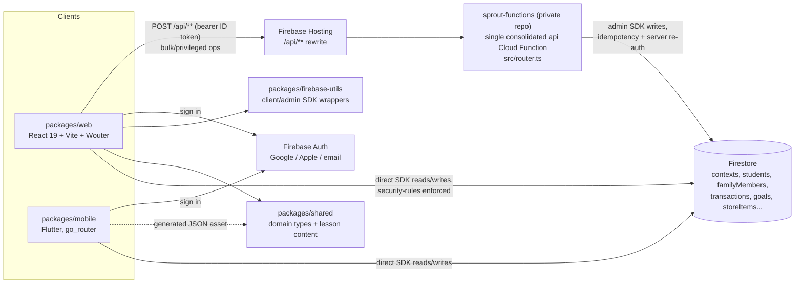

# Sprout Streak

Sprout Streak is a subscription-based classroom and family financial-literacy app — a
digital reward/behavior-tracking system with no ads, built for schools and
families rather than the ad-monetized arcade-game portfolio this org also
ships. The repository contains a working web/mobile product foundation,
public stakeholder and curriculum pages, school/classroom workflows, and the
implemented Firestore schema and security rules.

## Demo

Sprout Streak is a no-ads, subscription reward/behavior-tracking app for
classrooms and families: teachers or parents award "earn"/"spend" ledger
transactions in practice dollars (never real money — see the "Practice
money" label in `TodayPage.tsx`), students track a running balance and
savings goals, and eight starter financial-literacy lessons
(`packages/shared/src/content/lessons.ts`) tie the mechanics back to a
CFPB-aligned curriculum.

### Architecture



The business-logic Cloud Function itself lives in the private
`sprout-functions` repo, so its internals aren't shown here — only the
client-side contract this repo calls into it with.

### Walkthrough: a teacher awards a whole class

1. On the roster, the teacher checks several students and opens the group
   composer (`packages/web/src/features/classroom/components/transaction-composer/GroupTransactionComposer.tsx`),
   picking "Earn", an amount, a reason, and an optional `just_in_case`
   savings label.
2. Submit calls `recordBulkTransaction()` (`packages/web/src/lib/api.ts`),
   which `POST`s to `/api/classrooms/{contextId}/transactions/bulk` with a
   client-generated `idempotencyKey` and a bearer ID token:
   ```json
   {
     "idempotencyKey": "b7e2b6b0-2f9b-4c3a-9c1e-2a6b1a0e9f11",
     "type": "earn",
     "amountCentsEach": 50,
     "reason": "Weekly reading log",
     "recipientStudentIds": ["stu_123", "stu_456"],
     "savingsLabel": "just_in_case"
   }
   ```
3. The private `sprout-functions` repo's consolidated `api` function handles
   it: it re-checks award authorization server-side and uses the
   idempotency key so a retried request can never double-credit a student
   (see the doc comment on `recordBulkTransaction`). It replies with a
   `BulkTransactionOutcome`:
   ```json
   { "succeeded": ["stu_123", "stu_456"], "failed": [] }
   ```
4. For a single student instead, the client skips the Cloud Function and
   writes straight to Firestore via `recordTransaction()`
   (`packages/web/src/lib/firestore.ts`): one batch that adds a
   `contexts/{contextId}/transactions` doc, increments
   `students/{studentId}.balanceCents`, and — if the earn is tied to a
   goal — increments that goal's `savedCents`, all gated by
   `firestore.rules`.
5. The student's `TodayPage`
   (`packages/web/src/features/student/TodayPage.tsx`) has a live
   `onSnapshot` subscription via `useTransactions`/`useGoals`
   (`lib/firestore.ts`), so the new balance, goal progress bar, and the
   transaction itself appear immediately with no page reload.

## Key Features

The current foundation provides:

- Google, Apple, and email/password authentication paths
- School, classroom, staff-access, roster, student-ledger, and bulk-operation workflows
- A responsive public website with stakeholder, curriculum, readiness, privacy, terms, cookies, and support routes
- Eight original Pre-K–6 starter lessons
- A shared evergreen/mint/coral design system for public web, authenticated web, and Flutter
- Firebase project config for dev/staging/prod, a consolidated backend
  (single `api` Cloud Function behind a Hosting `/api/**` rewrite)
- CI/CD wired to the same `develop` → `staging` → `main` promotion model as
  the org's other apps

## Getting Started

This project consists of:
- **Web App**: React 19 + TypeScript + Vite (`packages/web/`)
- **Mobile App**: Flutter app for Apple iPhone/iPad and Google Android
  phone/tablet form factors (`packages/mobile/`)
- **Backend**: Firebase Functions — the live API. Real backend source lives
  in a private companion repo (`NelsonGrey/sprout-functions`);
  `packages/functions/` is gitignored here and must be cloned separately for
  local dev/emulator use:
  ```bash
  git clone https://github.com/NelsonGrey/sprout-functions.git packages/functions
  cd packages/functions && npm ci && npm run build
  ```
- **Shared Libraries**: Common TypeScript types (`packages/shared/`)
- **Firebase Utils**: Client/Admin SDK helper wrappers (`packages/firebase-utils/`)

### Prerequisites
- Node.js 20+
- Flutter SDK 3.24+
- Xcode (for iOS development)
- Android Studio (for Android development)
- Firebase CLI (`npm i -g firebase-tools`)

### Quick Start
```bash
# Install dependencies
npm install

# Start the web dev server
npm run dev

# Run the mobile app
cd packages/mobile && flutter pub get && flutter run

# Run the Firebase emulators (auth/firestore/storage/functions)
npm run emulators
```

### Tests
```bash
npm run test           # web + shared + firebase-utils
npm run test:mobile    # Flutter widget tests
```

## Technical Details

### Architecture
- **Frontend**: React 19 + TypeScript + Vite, Wouter for routing, TanStack
  Query, Radix UI, Tailwind CSS v4
- **Backend**: Firebase Functions (TypeScript) + Firestore, one consolidated
  `api` Cloud Function behind a Hosting `/api/**` rewrite — chosen over a
  standalone-function-per-endpoint model to keep the default public attack
  surface small and centralize auth/dispatch in one place
  (`sprout-functions`'s `src/router.ts`)
- **Mobile**: Flutter, `go_router` for navigation, `provider` for state
- **Design system**: semantic CSS/Tailwind tokens in
  `packages/web/src/index.css` and matching Flutter palette/breakpoints in
  `packages/mobile/lib/design_system/sprout_theme.dart`; one 1280px web
  content boundary with responsive 20/32/48px gutters
- **Auth**: Google + Apple sign-in, both platforms behind an `AuthService`
  interface (`packages/mobile/lib/core/services/auth/`) extracted from the
  org's shared `game-shell` package's auth layer — everything else in
  `game-shell` (AdMob ads, GDPR/ATT consent, IAP ad-removal) was
  deliberately left out, since Sprout Streak is a no-ads subscription product, not
  one of the ad-monetized arcade games that package targets

### System Requirements
- **Browser Support**: Chrome, Firefox, Safari, Edge (latest versions)
- **Mobile Support**: iPhone/iPad on iOS/iPadOS 16+; Android phones/tablets
  on the project API 21+ minimum. Each form factor requires its own release QA.

### Firebase Projects
Three environments, one Firebase project each — see `.firebaserc`:

| Alias | Project ID |
| --- | --- |
| development (default) | `nelsongrey-sprout-dev` |
| staging | `nelsongrey-sprout-staging` |
| production | `nelsongrey-sprout-prod` |

Config is split across `firebase.json` (staging/prod-strength CSP, used as
the default) and `firebase.dev.json` (lighter headers, used for local/dev
deploys) — deploy with `firebase deploy --config firebase.<env>.json`.

## Automated Deployment

Push to `develop`/`staging`/`main` deploys web hosting to the matching
environment (see `.github/workflows/firebase-hosting-*.yml`); `master-pipeline.yml`
handles build/test/functions-deploy and pulls `sprout-functions` in via a
`FUNCTIONS_REPO_PAT`-authenticated checkout, branch-mapped to the target
environment.

### Manual Deployment
```bash
npm run deploy          # deploy web + functions
npm run deploy:web      # deploy web only
```

## Getting Help

- **Documentation**: this README, plus:
  - [Business Requirements](docs/BUSINESS_REQUIREMENTS.md) — market/competitive analysis (ETM Machine + ClassBank deep dives), personas, revenue model
  - [Technical Requirements](docs/TECHNICAL_REQUIREMENTS.md) — architecture, implementation status, proposed Firestore data model
  - [Application Detailed Designs](docs/detailed-design/README.md) — implementation-ready responsive web, iPhone/iPad, and Android phone/tablet designs with persona/use-case traceability
- **Security**: see `.github/SECURITY.md`

---

© 2026 Sprout Streak, a product of Nelson Grey LLC. All rights reserved.
